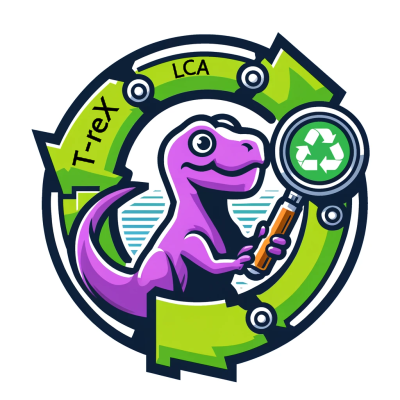

T-reX documentation
=====================================================

The T-reX tool is a python package that allows one to easily and flexibly calculate the waste and material footprint of any product or service inside of life cycle assessment (LCA) databases. Currently it has been tested with ecoinvent 3.8, 3.9, 3.9.1 and 3.10.

`View the example output here <_static/example-output.html>`_

.. toctree::
   :maxdepth: 2
   :caption: Contents

   intro
   installation
   usage
   configuration
   modules
   examples
   example_output
   source_code
