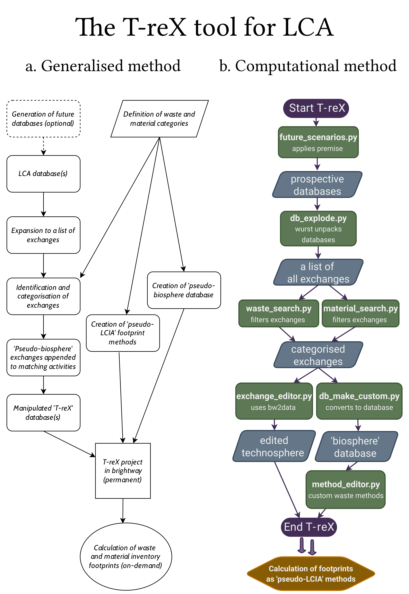

Introduction
============

T-reX [T(ool) reX (reduce, recycle, etc.)] is a python package that makes it easy to calculate the waste generation and material demand footprints of any product or service inside of future and prospective life cycle assessment (LCA) databases. Currently tested with the database ecoinvent 3.5--3.10.

For more information on the background and motivation of T-reX, see the manuscript on its  `Github repo <https://github.com/Stew-McD/T-reX_Publication>`_.

.. Motivation
.. **********

.. The waste and material footprint are two indicators that are used to assess the material efficiency of a product or service. The waste footprint is defined as the mass of waste generated per unit of product or service. 

.. Limitations
.. ***********

.. As the tool is based on the

